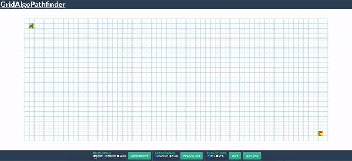

[GridAlgoPathfinder Live Link](https://anisurk24.github.io/GridAlgoPathfinder/)

# GridAlgoPathfinder

GridAlgoPathfinder is a pathfinding visualizer created with JavaScript, jQuery, HTML, and CSS. It is intended for users to observe how Breadth First Search (BFS) and Depth First Search (DFS) work on grids and mazes of varying sizes and styles. this visualizer uses a grid system where the start and goal are found on opposite corners one block in.

## Technologies Used:

* [JavaScript]
* [jQuery](https://api.jquery.com/)
* [HTML/CSS]

## Features:



The user has the ability to generate grids in 3 sizes. Currently, they have the ability to generate a random block filled grid along with the ability to clear the grid.

```JavaScript
  newGrid($graph) {
    const height = this.height;
    const width = this.width;
    const gridSize = this.gridSize;
    const $cellHTML = $("<td />");

    $cellHTML
      .width($graph.width() / gridSize - 1)
      .height($graph.width() / gridSize - 1);

    for (let row = 0; row < height; row++) {
      let $rowHTML = $("<tr />").addClass("grid-row");
      const currentGridRow = [];

      for (let col = 0; col < width; col++) {
        const newNodeId = `${row}-${col}`;
        let newNodeClass;
        let newNode;

        let $cell = $cellHTML.clone();
        $cell.attr("id", newNodeId);

        if (row === 1 && col === 1) {
          newNodeClass = "start";
          $cell.addClass("start");
          this.start = `${newNodeId}`;
        } else if (row === height - 2 && col === width - 2) {
          newNodeClass = "goal";
          $cell.addClass("goal");
          this.goal = `${newNodeId}`;
        } else {
          $cell.addClass("walkable");
          newNodeClass = "walkable";
        }

        newNode = new Node(newNodeId, newNodeClass);
        $rowHTML.append($cell);
        currentGridRow.push($cell);
        this.nodeObject[`${newNodeId}`] = newNode;
      }

      this.grid.push(currentGridRow);
      $graph.append($rowHTML);
    }
  }
```

Grid and nodes were created using HTML (<tr>) table row and (<td>) table cell tags.